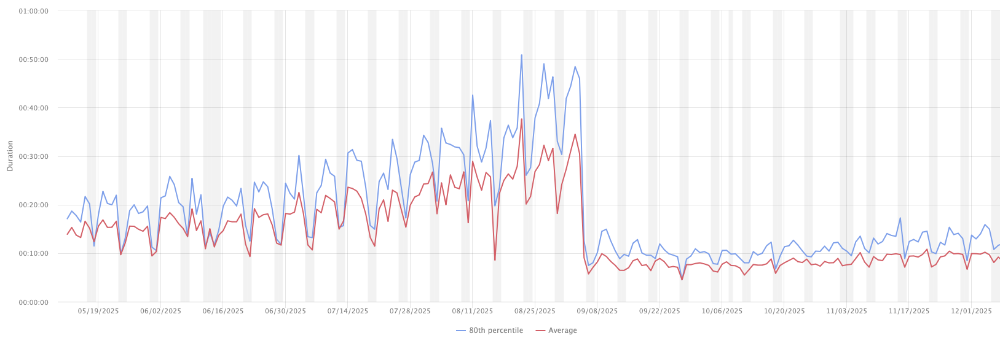

# Playwright's Bloated metainfo.json File

Metainfo.json file is reduced from 1.4M to 4.0K in provided example

```
1.4M    current/playwright/.cache/metainfo.json
4.0K    patched/playwright/.cache/metainfo.json
```

## Proposal

Remove the `?` or `#` part from dependencies in the `metainfo.json` file.

## Description

`@playwright/experimental-ct-core` generates a `metainfo.json` file used for caching and other optimizations performed by Playwright under the hood.

The current implementation relies on a Vite plugin to generate this file. However, Vite prohibits the usage of `#` and `?` in file names, meaning there is no reason to store them in the `metainfo.json` file.

> Both # and ? are reserved for compatibility with browser URLs.
>
> -- <cite><a href="https://github.com/vitejs/vite/issues/11784#issuecomment-1798854088">patak-dev</a></cite>

We experienced two major issues with the current behavior:

- Our `metainfo.json` file exceeded 512MB, which is the hard limit for the `JSON.parse()` method, resulting in unexpected crashes

- This data was serialized and deserialized each time tests ran, resulting in a 4x slowdown of tests in our project


